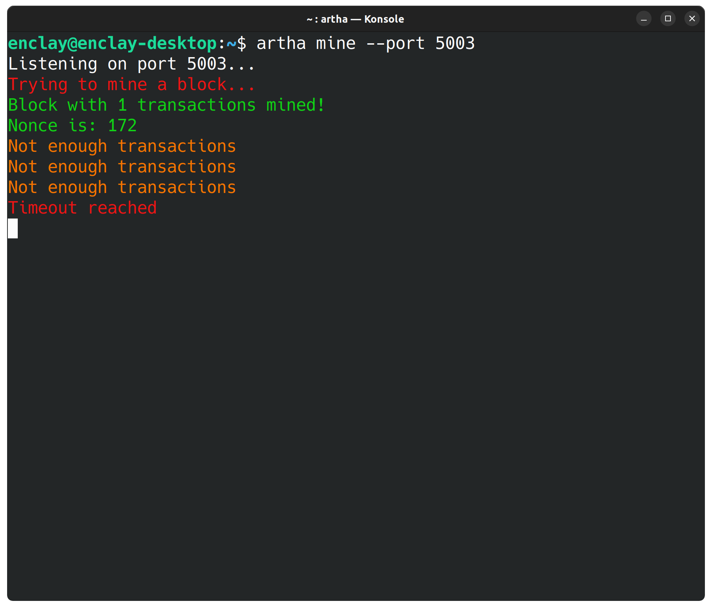
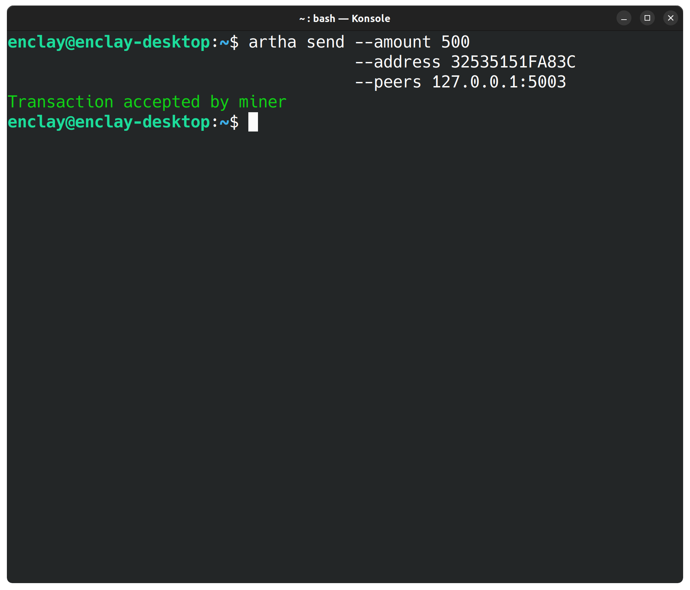

<div id="user-content-toc" align="center">
  <ul>
	<summary><h1 style="display: inline-block;">Artha</h1></summary>
  </ul>

  In Sanskrit: **अर्थ** = one of the main life objectives: **wealth and prosperity**
</div>

___

</br>

<div align="center">
Artha is a simple implementation of a cryptocurrency written from scratch. </br>
It is a proof-of-concept and cannot be regarded as stable.
</div>

</br>

<div align="center">
	
</div>

<details>
	<summary>
		<h4> Send a transaction </h4> (screenshot)
	</summary>
	<p align="center">
		
	</p>
</details>

# Features
* **Full** and **miner** nodes supported
* **Assymetric** key generation on secp256k1 elliptic curve
* **P2P** via websockets


# Compilation

1. **Install dependencies:**

   Install CMake and external dependencies:

   <details>
   <summary>On Ubuntu</summary>

   > ```sh
   > sudo apt install cmake libboost-all-dev libssl-dev
   > ```
   </details>
   
   <details>
   <summary>On MacOS</summary>

   > ```sh
   > brew install cmake boost openssl
   > ```
	
   </details>
	
2. **Download sources:**
   ```bash
   git clone --recursive https://github.com/enclay/artha.git
   cd artha/
   ```

3. **Build with CMake:**
   ```bash
   mkdir build && cd build
   cmake .. && make
   ./artha
   ```
