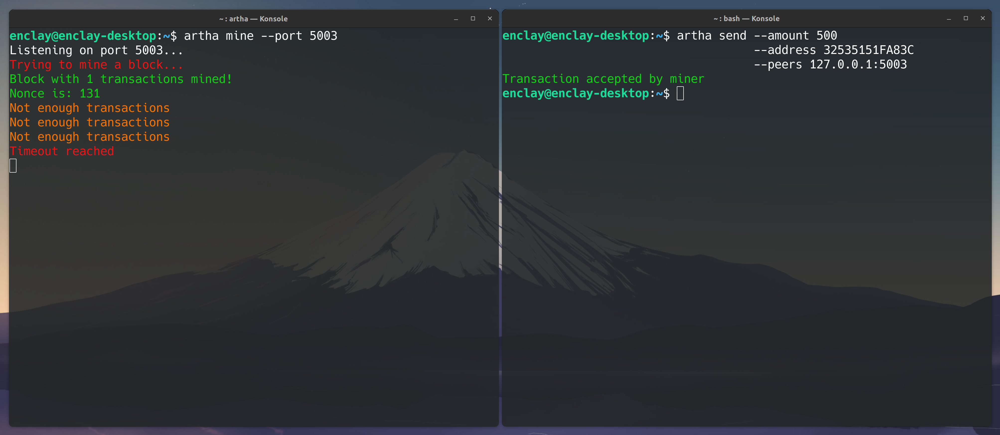

# artha


# Compilation
   
* Download sources:
  ```bash
  git clone --recursive https://github.com/enclay/artha.git
  cd artha/
  ```

* Build with cmake:
  ```bash
  mkdir build && cd build
  cmake .. && make
  ./artha <command> [options]
  ```
